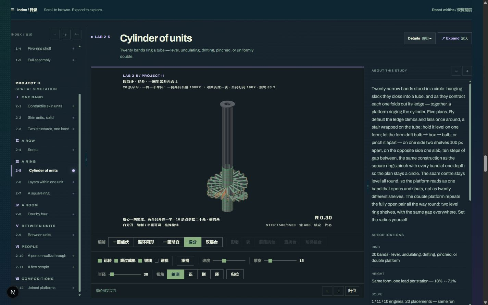
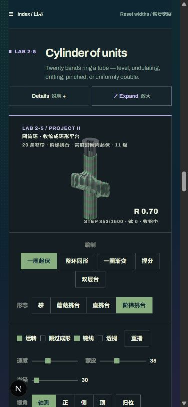

# Lab UI 试用版 · 2026-09-29

用户要求“先做吧，我先看看”后，将自审收紧后的方向实现于本地 `/lab`。这是一版可实际操作的页面，尚未获用户视觉与手感确认。

## 可试的操作

- 页顶常驻 Index / 目录按钮，可收起和恢复目录；目录边界可拖动，也可用方向键、+/− 调宽。
- 每台顶部 Details / 说明控制完整说明与规格的显示；桌面可拖边界调宽，宽度偏好全页共用。宽度不足时说明移到画面下方。
- 普通页保留台架参数与鼠标拖动；滚轮经过 3D 画布继续滚页。支持相机缩放的台架提供 +/− 与归位。
- Expand / 放大把当前实例展开；普通滚轮此时缩放模型，说明单独滚动，Restore / 恢复或 Esc 返回。
- 手机默认收起目录与说明，画布在短说明之后。浏览态允许单指滑页；放大后才进行触摸拖动。实机触屏和触控板捏合仍需用户手测。

## 验证记录

| 检查 | 结果 |
|---|---|
| 完整 Vitest | 55 个测试文件、672 项通过；新增 4 项输入策略测试，原终态组件测试补齐 DOM 夹具后通过 |
| Vite + Next 双构建 | 通过；最后的布局与深链修订另跑 Next 生产构建和 TypeScript 检查通过 |
| 普通浏览滚轮 | 触手台架：scrollY 1940→2210，相机 ×1.00 保持不变 |
| 放大态滚轮 | 页面 scrollY 保持 1548.67，相机 ×1.20→×0.87 |
| 展开、调宽、恢复 | 触手肌腱 1% 与相机 ×0.87 均保留，退出后无 dialog、inert 或滚动锁残留 |
| 说明独立滚动 | 放大圆筒环后，说明 scrollTop→307.33，工作区滚动位置不动 |
| 真实拖拽目录 | 1280px 下目录由 208→248px，画面区域保有约 620.67px，说明自动限制到 282px；无整页横向溢出 |
| 键盘与恢复入口 | 目录与说明分隔器方向键有效；目录收起后常驻按钮可恢复；Esc 恢复后焦点回到展开入口 |
| 多层台 | 目标/成形切换有效，已有倾角 1° 在切换与退出放大后保留；多个视图保留，复杂内容在放大区内滚动 |
| 旧编制深链 | 直接加载 `#lab10-split` 后迁移至 `#lab2-5-split`，选中“捏分”，最终标题约落在视口 78px 处 |
| 浏览器后退 | 退出临时放大，背景 inert、滚动锁正常清理 |
| 窄屏 | 390×844 下 17 台均无整页横向溢出；普通画布为 `pan-y pinch-zoom`，放大态恢复原手势规则 |
| 桌面 | 检查 1280×800、1366×768、1440×900；主要控制区参与高度预算 |
| 其他路由 | 主页与项目二案例页正常载入，未出现 Lab 布局外壳；控制台无本轮检查可见的 error / warn |

浏览器检查使用本地开发页，不代表生产站已经更新。上述都是本轮开发验证，不是参与者可用性研究。

## 试用截图

## 实现与边界

复用全部台架与唯一目录；新增布局外壳、面板活动上下文和局部相机输入桥接。求解器、相机数学、真实网格、既有编制与研究结论没有为 UI 重写。完整说明原文保留，短说明复用目录；触手摘要中已失效的“16 节”纠正为当前模型的“7 方盒椎节”。

宽度偏好存本地浏览器，放大状态不保存。拖动宽度到受限值后不会继续挤小画面；复杂多视图台架不能保证所有控件在一屏内同时展开，但均可在放大区内到达。Ctrl/Cmd 等修饰键不交给模型；真实触控板捏合、手机触屏手感和跨浏览器行为未宣称完成实测。

本轮没有部署。工作区已有的多层成形开发和文档修改保留，未作为 UI 重写的一部分处理。
