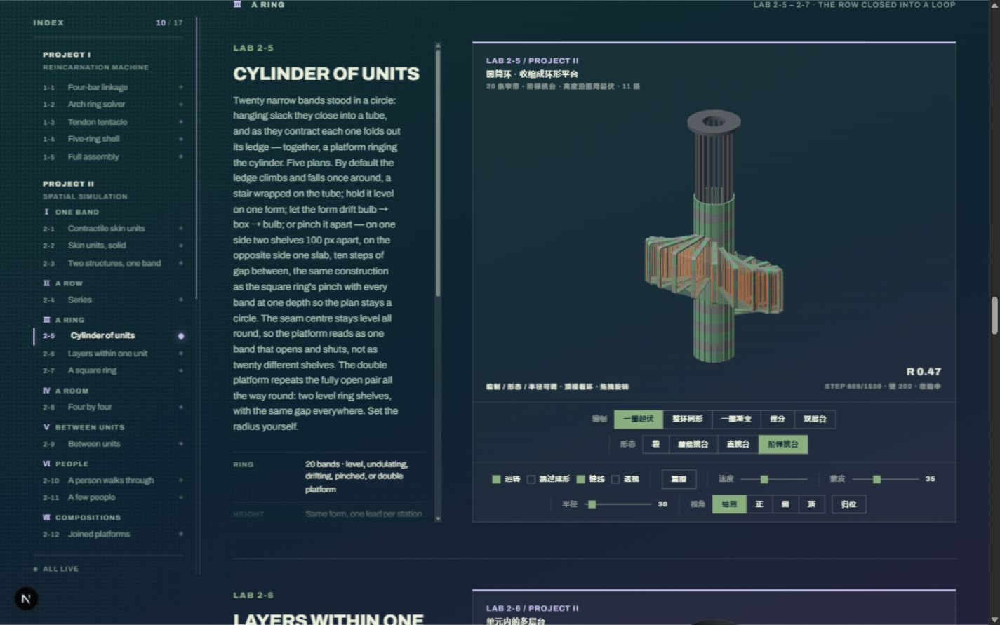
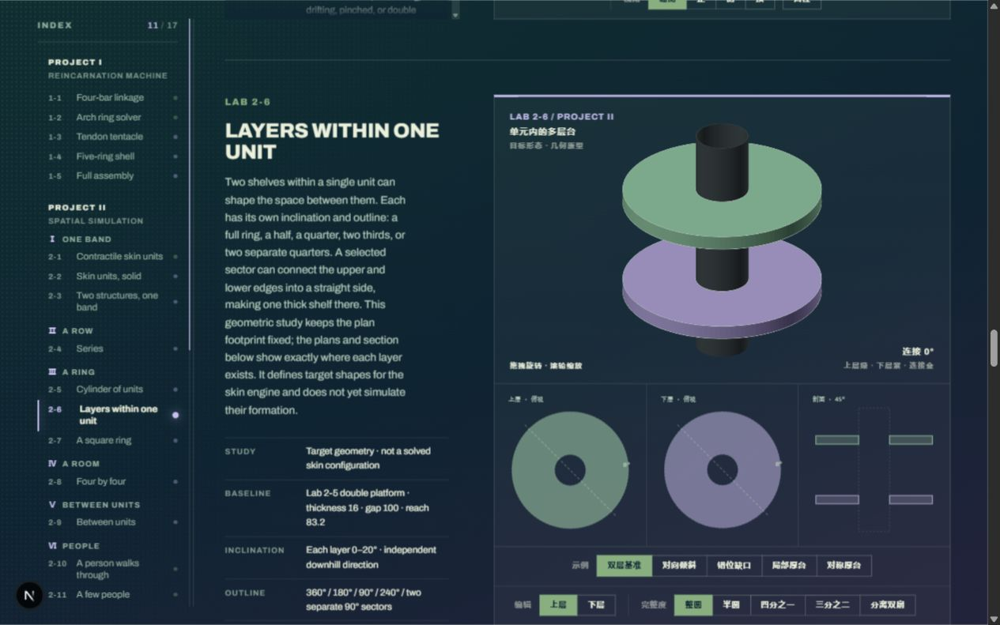
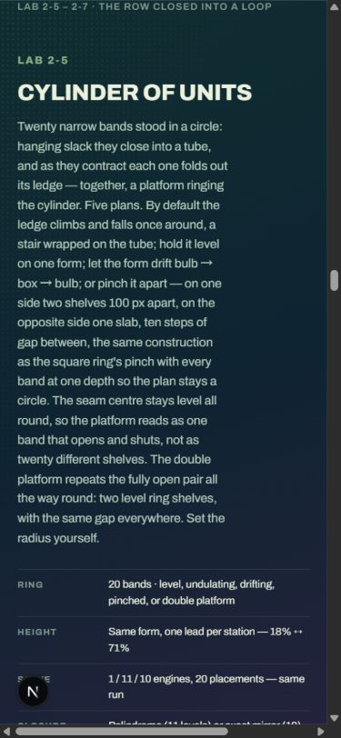

# Lab UI 研究：空间分配、滚动隔离与视觉层级

研究日期：2026-09-28。初版建议保留于下文；2026-09-29 已按用户要求实现本地试用版，**视觉与手感尚未定稿**，见 [试用与验证记录](IMPLEMENTATION.md)。

> **2026-09-29 自审修订：** 下文保留初版研究。最新建议见 [方案自审与修订](REVIEW-2026-09-29.md)：保留页面内直接试用，专注放大作为可选功能；取消“必须进入工作台才能操作”的倾向。面板尺寸、视觉效果与状态连续性仍未经过原型验证。

本轮核对了本地 `/lab`、现有组件、设计原稿与外部一手资料。结论针对当前工作区，不代表生产站已经同步。当前目录为 17 台，页面编号为项目一 1-1～1-5、项目二 2-1～2-12。工作区原有未提交修改，本轮仅新增本研究文件与截图。

## 1. 建议先改变什么

**推荐保留浏览总览，再提供一个可展开的单实验工作台。** 浏览时，页面滚动始终优先；进入工作台后，画布才接管普通滚轮。目录和详情支持收起、展开与受限调宽，画布自动获得剩余空间。

这项建议有三层，不能混为“加缩放”：

1. **面板调宽**：分配屏幕空间，文字重排、画布重新适配。
2. **收起 / 展开 / 专注**：在浏览目录、读说明、操作实验之间切换。
3. **相机缩放**：改变模型在画面内的大小，不改变网页布局，更不改变实验参数。

不要把整个详情框用 `transform: scale()` 缩小；文字与点击目标会一起变小，而且没有真正重新分配布局空间。也不要把模型缩小解释为结构“收缩”：目前滚轮改的是相机倍率，实际形态参数没有随之改变。

优先级建议：**先明确浏览与操作边界，再整理内容层级，再确定可调面板的细节。** 仅给现状三个区域加拖拽手柄，能缓解拥挤，但仍会保留说明长、控件碎、鼠标所在位置决定滚动结果等问题。

## 2. 当前页面的证据

### 2.1 布局实际是两层网格叠起来的

```text
整页：目录 240px + 间隔 48px + 右侧内容
右侧：说明 300px + 间隔 44px + 台架

读者看到：目录 ｜ 说明 ｜ 台架
```

1280～1439px 下目录变为 200px、间隔 40px；说明仍固定为 300px。<1280px 目录应回落到页顶芯片带，<1024px 说明和台架变成上下排列。两组断点分属不同层。

依据：[`globals.css`](../../app/globals.css) 的 `.lab-section`（约 2644 行）、`.lab-copy__inner`（约 2664 行）、`.lab-layout`（约 2709 行）；[`page.tsx`](../../app/(site)/lab/page.tsx) 的 `Bench`（约 158 行）。

浏览器测量，取 Lab 2-5 圆筒环；单位为 CSS px，取整，滚动条占宽包含在实测中：

| 视口 | 目录 | 说明 | 画布 | 控制区高度 | 说明可见 / 全部高度 |
|---|---:|---:|---:|---:|---:|
| 1440 × 900 | 240 | 300 | 695 | 173 | 693 / 1301 |
| 1280 × 800 | 200 | 300 | 583 | 202 | 638 / 1301 |
| 390 × 844 | 页顶目录 | 上下排列 | 333 | 本轮未量 | 1202 / 1202 |

结论：1440 下，画布宽约为视口的 48%；1280 下约为 46%。屏幕变窄后控制条折更多行，说明可见范围约为全文一半（1440 下约 53%，1280 下约 49%）。手机上则要先越过约 1202px 的说明和规格，才到画面。这比“框不能缩放”更直接地影响首次体验。







### 2.2 滚轮问题已复现

在 Lab 1-3 触手画布中央向下滚动一次：

- 页面 `scrollY`：约 1452.67 → 1452.67。
- 台架显示倍率：×1.00 → ×0.50。
- 鼠标没有明确进入任何“操作模式”。

这是**本想继续翻页，却被画布接管**。此次没有复现“同一个事件让页面和相机同时动”，不能把两种现象混写。

四处直接接线都先调用 `preventDefault()`，再调用 `cam.wheel(deltaY)`，且监听设置为 `passive:false`：

| 接线位置 | 覆盖范围 |
|---|---|
| [`TentacleBench.tsx`](../../components/lab/TentacleBench.tsx)，约 300 行 | 1-3 触手 |
| [`RingsBench.tsx`](../../components/lab/RingsBench.tsx)，约 529 行 | 1-4 五环 |
| [`SkinSolidBench.tsx`](../../components/lab/SkinSolidBench.tsx)，约 1289 行 | 共用它的项目二立体带、环、阵列、关系与组合台架 |
| [`SkinLayersBench.tsx`](../../components/lab/SkinLayersBench.tsx)，约 103 行 | 2-6 多层台目标几何 |

[`camera3d.ts`](../../src/lib/linkage/camera3d.ts) 的 `wheel()` 只处理相机倍率，并把相机标记为用户接管。一次误滚还可能让原本的相机空闲自转停下，影响不只是一时变小。

**已存在的例外不能抹掉：** [`MachineBench.tsx`](../../components/lab/MachineBench.tsx) 约 957 行明确记录，整机视角只由按钮控制，不挂旋转、平移、滚轮。这是用户原有决定，不应借“统一交互”重新开启。2D 拖关节、平面拖人也不能套用 3D 相机手势。

### 2.3 视觉问题的判断

以下是基于现状的设计判断，不是用户测试统计：

| 观察 | 为什么会显得拥挤或生硬 | 候选调整 |
|---|---|---|
| 目录、英文标题、中文 HUD、规格、控件同时争夺注意力 | 读者先看到几套界面，再找模型 | 一处主标题；编号与状态保留，小字技术读数按需展开 |
| 原稿针对四台短说明，目前已增长到 17 台，部分说明数百词 | 原本的编辑式侧注变成窄幅长文 | 一句概括先出现；完整原理与规格有清晰入口，保留全文 |
| 控件居中换行，多条竖分隔线与按钮边框挤在一起 | “解什么”和“怎么看”虽然已有两层，视觉上仍很碎 | 沿用两层语义，改为对齐的参数组；常用操作与高级参数分层 |
| 整页渐变、目录点阵、台架点阵与多个框线叠加 | 背景也在制造细节，模型轮廓的优先级下降 | 先减少工作区背景纹理与重复边线，保留必要工程标记 |
| 目录的滚动条被隐藏，详情有另一条滚动条，页面还有一条 | 边界行为需要试出来 | 浏览态减少局部滚动；工作台才保留清楚命名的独立滚动区 |
| 手机按“长文→全部规格→画面”排列 | 看到实验前要先读很久 | 标题与短说明→画面→主要操作→展开详情 |

仍值得保留：按项目与尺度组织的目录、绿紫编码、真实模型、明确编号、发丝线、离屏停启、可直接分享的锚点。它们已经形成了网站身份。

另外，本地 390 宽视口的整页 `scrollWidth` 约为 523px，存在横向溢出；检测到部分控件组越界。此为附带发现，尚未逐台定位，不能据此声称每台都溢出。当前共享 `.lab-fig canvas/svg` 的 `touch-action:none` 也提示手机滑页需要单独研究；本轮没有实机触屏验证。

## 3. 外部参考：借哪些具体机制

所有链接于本轮查阅。产品文档说明已有做法，不能替代本站的可用性验证。

| 一手来源 | 确认了什么 | 对本站的启发 / 边界 |
|---|---|---|
| [VS Code · Custom Layout](https://code.visualstudio.com/docs/configure/custom-layout) | 侧栏显示切换、面板最大化、Zen Mode、恢复布局 | 用“收起 / 展开 / 专注 / 恢复”表达空间控制；不照搬整个 IDE 的密集工具栏 |
| [Google Maps · Controlling Zoom and Pan](https://developers.google.com/maps/documentation/javascript/interaction) | 文档明确讨论滚页误缩放；cooperative 允许正常翻页，另提供缩放控件；greedy 接管手势 | 页面嵌入物需要明确让出默认滚动；地图规则不能原样覆盖拖人、拖关节 |
| [model-viewer · Staging & Camera Control](https://modelviewer.dev/examples/stagingandcameras/) | 支持禁用用户缩放，使滚轮和捏合回到浏览器默认行为；视角归位需要考虑 | “模型能旋转”不等于“必须吞掉滚轮”；缩放可以由明确状态开启 |
| [Bartosz Ciechanowski · Mechanical Watch](https://ciechanow.ski/mechanical-watch/) | 同篇中通过拖模型、滑块、局部按钮解释具体机制，提供统一暂停 | 画面、问题与关键操作紧邻；技术深度不必等于首屏控件密度 |
| [W3C APG · Window Splitter](https://www.w3.org/WAI/ARIA/apg/patterns/windowsplitter/) | 可聚焦分隔器、方向键调节、Enter 折叠恢复、尺寸值与名称 | 调宽必须有键盘与明确命名；该模式页注明示例与审阅仍在完善，不能仅照抄就宣称合规 |
| [WCAG 2.2 · Dragging Movements](https://www.w3.org/WAI/WCAG22/Understanding/dragging-movements.html) | 作者实现的拖动应有无需拖动的单指针替代，键盘替代本身还不够 | 面板除拖拽外提供点击调宽/数值或步进操作；仅做键盘方向键不足以覆盖触屏用户 |
| [MDN · wheel](https://developer.mozilla.org/en-US/docs/Web/API/Element/wheel_event)、[overscroll-behavior](https://developer.mozilla.org/en-US/docs/Web/CSS/Reference/Properties/overscroll-behavior) | wheel 与 scroll 不等价；触控板缩放也可能发 wheel；overscroll 处理滚动链 | 画布手势和面板滚动链是两类问题，需要分别处理 |

视觉取向推荐“**有编辑层级的实验台**”：让模型、短说明和关键操作构成主画面。深色绿紫语言可以继续使用；布局重排先于换色和装饰动效。此判断是结合现有风格与使用场景作出的设计推论，并非上述产品共同给出的标准答案。

## 4. 三条布局路线

| 路线 | 结构 | 好处 | 代价 | 判断 |
|---|---|---|---|---|---|
| A：现有长页加弹性 | 保持目录→说明→台架；目录可收，说明可折叠、可调宽 | 改动较小，读位与锚点容易保留 | 多台长文仍形成长页，局部滚动仍多；拖宽说明会挤画布 | 可作为局部改善方案，难单独完成视觉重构 |
| B：固定单实验工作台 | 左目录、中画布、右详情，点击换实验 | 画面稳定，边界清楚，适合反复操作 | 总览与演进关系变弱；要处理状态保存、浏览器返回、移动端与检索 | 若作者把 Lab 当常用工具，可考虑 |
| C：浏览总览＋专注台架 | 总览呈现项目/尺度/短说明；某台可展开成工作台 | 同时服务首次浏览与深入操作，滚轮归属最清楚 | 多一种状态，进入与返回、状态连续性必须设计 | **推荐研究方向** |

推荐 C 的具体含义：

```text
浏览总览（正常页面滚动）
项目 / 尺度目录 → 实验标题、短说明、较大预览、展开操作入口
                         ↓ 点击「展开操作」
专注台架（单台占主要视口）
可收目录 │ 活的画面 + 常用操作 │ 可收详情：参数 / 说明 / 规格
                         ↓ 返回浏览 / Esc
回到进入前的实验与阅读位置
```

不是必须新开路由；可以在 `/lab` 内实现。现有 `#lab2-5`、带编制的哈希与旧哈希仍需要可靠落点。是否让直接访问深链默认进入专注模式，应在原型阶段确定；本研究不擅自改变现有链接含义。

浏览总览并不一定要改成卡片墙。可继续沿用发丝线项目清单和尺度分段；选中的实验突出，其他条目保持可扫读。不要让用户为了知道“有哪些台架”反复进入退出。

## 5. 面板该怎样调节

### 5.1 三个区域不采用完全相同的操作

| 区域 | 推荐行为 | 原因 |
|---|---|---|
| 目录 | 展开为可读列表；收起为紧凑入口；宽屏允许调宽 | 目录不需要随模型一起放大，也不能靠过小字号省空间 |
| 详情 | 独立开关；工作台中可调宽；有参数、说明、规格层次 | 读长解释和调参数是不同任务 |
| 画布 | 自动占剩余空间；一键专注；独立相机缩放 / 归位 | 三个面板都允许任意二维缩放会互相挤压，很难保持结构稳定 |

建议先确定“标准 / 多看画面 / 专注”几种可恢复状态，再决定连续拖拽的范围。拖拽是补充，不能成为唯一入口。

### 5.2 初始尺寸是假设，需要原型验证

工作台可先试：目录默认 208px、范围 176～280；详情默认 320px、范围 280～400；两处分隔区域各 12px。画面建议争取至少 720px，640px 作为桌面折叠判断的初始下限。以上均为设计试值，不是现有规范或测试结果。

以 1440 视口、两边各 24px 为例，208 目录＋320 详情＋24 分隔后，中间约 840px；若收起目录为 56px，中间约 992px。增大的来源包括减少原来两层宽间距与两侧占用，不能全部归因于“能拖动”。正式排版应再扣除实际滚动条与边线。

**约束用可用宽度计算**：若目录＋详情＋分隔＋最小画面无法共存，先收起详情或目录；不要继续压缩到模型与控件不可用。窄屏改为全宽画面与可展开详情，不保留三栏的缩小版。

画面要同时受可用高度限制：宽屏加宽后若强制整个框按 700:520 长高，会让控制条掉到屏幕外。可以让工作区适应视口、内部渲染面保持原比例并居中；进一步改变相机投影适配时，再单独验证拾取、平移、HUD 与清晰度。Lab 2-6 主画布是 700:440，且附三张正投影视图，也不能硬套全部台架同一高度。

### 5.3 调宽时需要保持的行为

- 字号不缩，内容换行；画面保持几何比例。
- 拖动边界不旋转模型、不改实验参数，也不重置相机。
- 画面宽度变化不重新挂载台架，不重新求解、不重播。
- 单条发丝线可保持克制，但可拖热区至少有足够宽度；悬停或聚焦才强化线与拖拽示意。
- 分隔器有名称、当前值、最小/最大值；方向键可调，Enter 可收起恢复。另有可点击步进或数值入口，提供不拖拽的等价操作。[APG](https://www.w3.org/WAI/ARIA/apg/patterns/windowsplitter/) / [WCAG 拖动说明](https://www.w3.org/WAI/WCAG22/Understanding/dragging-movements.html)
- 收起后焦点回到恢复按钮；隐藏区不继续获得 Tab 焦点。专注态保留明显的退出入口，Esc 作为补充。
- 可以记住个人面板宽度；恢复时按当前窗口重新限制。不要把上次的专注状态强加给每位首次访客。

## 6. 滚轮隔离：推荐的操作规则

### 6.1 按状态分配，不按“鼠标刚好经过”分配

| 状态 / 指针位置 | 普通滚轮或触控板双指滚动 | 其他操作 |
|---|---|---|
| 浏览态，画布上 | 滚页面，相机不变 | 可见的「展开操作」；桌面直接拖转是否保留，可在原型对比 |
| 专注态，支持缩放的 3D 画布上 | 相机缩放，背景页面不动 | 拖转、右拖平移、缩放按钮、视角归位 |
| 专注态，目录上 | 滚目录 | 到边界不带动背景 |
| 专注态，说明 / 规格上 | 滚该面板 | 到边界不带动背景 |
| 参数滑块、按钮、输入框上 | 不交给相机 | 控件保持自身的原生键盘与指针行为 |
| 整机 / 无缩放能力的 2D 台架 | 不产生相机缩放 | 仍使用自身已确认的操作方式 |
| Ctrl / Cmd 等修饰键缩放 | 保留浏览器功能，不用作本站唯一缩放入口 | 浏览器放大能力不被全局拦截 |

触屏建议：浏览态单指上下滑正常滚页；点击“展开操作”后才启用台架完整手势。画布外、退出按钮、详情都不被 `touch-action:none` 包住。进入模式应发生在明确点击之后，而不是某次触摸中途改变 `touch-action`。拖人 / 点地面放人只在操作态明确开启，避免滑页变成改实验。

本轮没有真实触控板或手机手势验证。触控板 pinch 在部分浏览器会以 `ctrlKey=true` 的 wheel 到达；初版应优先保留浏览器缩放，模型另有 + / −。若以后要在专注态接管 pinch，需要单独做平台测试，不能靠 `deltaY` 大小猜设备。[MDN wheel](https://developer.mozilla.org/en-US/docs/Web/API/Element/wheel_event)

### 6.2 三种常见替代方案的取舍

| 方案 | 优势 | 隐患 | 本站建议 |
|---|---|---|---|
| 鼠标悬停即缩放（现状） | 无需额外动作 | 路过就误操作、翻页中断 | 放弃作为浏览态默认 |
| 按修饰键＋滚轮 | 不增加界面状态 | 可发现性弱，系统与浏览器快捷键冲突；手机无键盘 | 最多作为补充，不做主方案 |
| 点击“操作”后锁定画布 | 意图清楚，鼠标和触屏都能表达 | 增加一次点击，必须有明显退出 | 推荐与专注台架结合，避免在长页里留下隐形锁定 |

不建议滚轮停留 300ms 后自动接管，也不建议滚到缩放极限后突然把剩余滚动交回页面：相同动作会在用户不知情时改变含义。

### 6.3 技术层面的边界

`overscroll-behavior-y: contain` 可以阻止目录或详情到边缘时连带滚动外层；它不负责判断画布是否应缩放。`stopPropagation()` 阻止事件传播，也不等于取消浏览器默认滚动。两者都不能单独解决当前问题。[MDN overscroll-behavior](https://developer.mozilla.org/en-US/docs/Web/CSS/Reference/Properties/overscroll-behavior)

后续落地应在 React / DOM 接线层引入统一手势策略，调用现成 `OrbitCamera.wheel()`，不重写相机数学或求解器。规则至少包括：当前展示模式、台架能力、事件目标、修饰键、`cancelable`、`deltaMode`。

- 浏览模式完全不调用相机 wheel，也不取消原生滚动。
- 操作模式只在命中可操作画布、无保留修饰键且能取消默认行为时接管。
- 接管时取消默认行为，再调相机；不可取消时避免相机与默认行为一起执行。
- 处理像素 / 行 / 页单位差异，避免不同鼠标缩放速度相差过大。
- 在画布本身接线，控件与说明不共用该监听。清理监听与状态时沿用现有组件生命周期。
- 现有四处监听必须改为共同策略，不能只在外层加一个监听，留下内层继续无条件接管。

专注打开后保存背景滚动位置，背景暂停滚动，关闭时恢复。若采用模态实现，需要焦点管理与背景不可操作；若采用页面内工作区，则按普通导航管理焦点，不额外制造焦点陷阱。

## 7. 视觉重构可以改得很明显，但不必换掉整个风格

建议保留 Archivo、绿紫、无圆角与工程图纸线条；改变它们的用量和层级：

1. **模型成为主图。** 浏览态标题＋短说明控制在很短的范围；技术规格默认不占固定 300px 长栏。
2. **工作区背景安静。** 页级渐变可留作身份，模型背后用较均匀的深色。点阵只在需要定位或比例感时出现；不同时给目录、页面和图框都加同强度纹理。
3. **区分说明和操作。** 说明回答“这台试什么、能看到什么”；常用控制紧邻画面；深入参数、求解读数与完整规格后置。现有正文先归位，不由模型擅自改写研究结论。
4. **控制条不再像零件清单。** 统一左对齐，按任务分组；保留“解什么 / 怎么看”的现有语义。复杂台架才用详情栏，简单四杆仍可很轻。
5. **主标题只出现一次。** HUD 保留编号、关键状态与操作提示；重复名称与长实现描述移到说明区域。诊断读数要能找到，但不必一直压在画面上。
6. **“可调”要看得出来。** 目录和详情有可见开关，边界在 hover / focus 时提供方向提示；收起后入口还在。不要只靠看不见的 1px 分隔线。
7. **状态切换只解释空间变化。** 面板展开和画面适配可用短过渡；拖动过程中直接跟手。减少动态效果时去掉过渡，功能保留。此次视觉方案仍需新设计稿确认，不能把主页动效例外自动推广到 Lab。

颜色对比度、英文/中文控件语言策略、具体字号与动效时长尚未定稿。本轮未做完整无障碍审计，不能宣称通过。

## 8. 已有实现怎样复用

| 现有实现 | 可保留的部分 | 需要的局部扩展 / 限制 |
|---|---|---|
| [`src/lib/site/lab-index.ts`](../../src/lib/site/lab-index.ts) | 唯一目录、分组、编号、短描述、内核颜色 | 不再复制清单；可另外登记交互能力，不能仅按 2D/3D 推断滚轮行为 |
| [`components/lab/LabIndex.tsx`](../../components/lab/LabIndex.tsx) | 长页读位、锚点、当前项标记 | 浏览态保留；单实验工作台需要选中状态，不能继续用整页滚动读线决定当前项 |
| [`components/site/HomeLab.tsx`](../../components/site/HomeLab.tsx) | 项目折叠、组内记忆、键盘导航模式 | 借其结构与状态原则；hover 切实验适合预览，不适合正在调整参数的工作台 |
| [`HomeLabPreview.tsx`](../../components/site/HomeLabPreview.tsx) | 原台架装配与按需载入思路 | 预览默认无控件且会切换卸载，不能原封不动当持久工作台 |
| `Bench` / [`LabCopyScroll.tsx`](../../components/lab/LabCopyScroll.tsx) | 标题、说明、规格、溢出提示 | 可抽成展示壳；浏览态详情不必继续限定为与台架同高的滚动栏 |
| `components/lab/*Bench.tsx` | 模型、控件语义、视角、参数、真实网格 | 增加展示模式和交互策略接口；不复制求解过程 |
| [`useBenchLoop.ts`](../../components/lab/useBenchLoop.ts) | 离屏 / 页面隐藏 / enabled 停启 | CSS 隐藏或被弹层盖住不等于自动停跑，专注态要显式门控背景 |
| `planHash.ts` / `LegacyLabHash.tsx` | 新旧编号与编制深链 | 重排仍保留入口；当前编号迁移已有语义冲突，不再自行发明另一套号 |
| `camera3d` / `gl3d` / `src/demo` | 相机、渲染器、原工程台架 | 保留 API 与数学；若超大画布需要清晰度提升，另评估像素缓冲适配 |

检索了 `components/`、`src/lib/site/`、`app/` 中的 resize / separator / panel 等相关实现：未发现可直接复用的通用可调分栏组件。现有 `ResizeObserver` 主要用于测量；`studio` 的 textarea resize 也不是面板分栏。**新增分隔器与展示模式管理有依据，新增一套求解器没有依据。**

还要防止一个看似简单的实现：把同一台架在“普通”和“专注”各渲染一次。这样会丢参数、重置成形过程、创建重复 WebGL 上下文。应优先保持同一实例；若确需卸载切换，先定义状态保存契约，不能事后补。

## 9. 下一轮应拿什么判断方案是否成立

这不是开发授权或排期，只列原型需要回答的问题：

| 任务 | 可检查的结果 |
|---|---|
| 不操作实验，从顶部滚到页面后半段 | 路过 3D 图不会误缩放，也不会因悬停停住页面 |
| 打开一台，调参数、转相机、收起两侧 | 参数、求解进度、相机姿态连续；画面比例正确 |
| 打开完整说明，滚到底 | 说明不带动背景；当前实验仍容易辨认 |
| 退出专注，再次进入 | 原阅读位置、参数和焦点按约定恢复 |
| 用方向键 / 点击而不是拖拽改变面板 | 全部核心调整有等价入口 |
| 触控板连续滚动与捏合；鼠标快速滚动 | 不出现相机与页面同时变化；保留浏览器缩放 |
| 390 手机、1024 小桌面、1280 笔记本、1440 / 1920 桌面 | 无整页横向溢出；关键操作可见；大屏不让画布无限长高 |
| 直接访问、后退前进、旧哈希、带编制深链 | 实验身份与入口不丢 |

典型台架至少覆盖：1-1（直接拖关节）、1-3（3D 相机）、1-5（固定视角例外）、2-5（复杂参数）、2-6（多视图几何）、2-11（拖人）。实际实现后按项目流程做 typecheck、相关守门与构建；研究阶段没有修改代码，因此没有运行整套测试或部署。

## 10. 范围与资料状态

- 已读依据：`SITE_SPEC.md` §1/§6/§7/§8、`LAYOUT_NOTES.md`、`design-ref/MAPPING.md` 的 Lab 原稿映射、目录、新主页 Lab 与最近台架更新，以及 `Lab-Modernist.extracted.html` 的布局、样式与交互声明和 `lab-solvers.reference.js` 的表现层样式。
- 当前暗色 Lab、目录与主页新版均有后续决定；不能以早期 SITE_SPEC 的旧状态概述抹掉已经实施的例外。
- 根目录引用的 `RTK.md` 未在工作区、直接祖先目录及本次可访问的 Codex 文件名检索中找到；本轮没有依赖它推断开发或发布权限。
- 实测是本地浏览器观察、DOM 度量和滚轮复现；不是跨浏览器性能评估，也不是参与者研究。
- 1279 宽的模拟视口出现分数像素与媒体查询结果不一致，本轮不把该次结果作为准确断点证据；正式回归需补真实窗口缩放 / 浏览器缩放测试。
- 本轮未改站点源代码、原设计规范、求解器、日志、部署配置；仅保存研究与截图。上述尺寸、状态和视觉方向均待下一轮原型检验。
